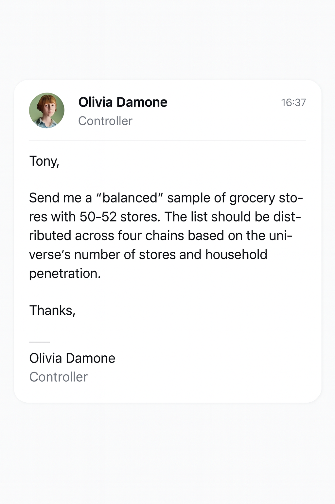

## Sample Brief: _Company XYZ Grocery Callfile_
This brief shows how balanced callfiles are typically requested in grocery activation cycles — fictional, anonymised and safe to publish.

It can be used to:

- explain why a balanced callfile is needed  
- support onboarding for field or insight teams  
- demonstrate real-world relevance in proposals

## Context 
> [!NOTE]  
> The current callfile hasn’t been chosen — The same grocery stores keep appearing because they’re familiar, easy to justify and rarely questioned.
> That has led to uneven representation, skewed activation insight and tension between Commercial, Field and Measurement teams who are working from different assumptions.

_**The Majórem Store Picker™**_ replaces that pattern with structure — creating a balanced callfile that reflects the real grocery universe: proportionate, consistent and simple to defend. 

Not another spreadsheet workaround, but a repeatable way of working that removes debate and strengthens confidence in activation results.

### The Controller's Email

>[!TIP]
>Most teams don’t ask for a _**“stratified sample.”**_  They ask for something like this:

  

  
   
    
*Fictional email example illustrating how balanced grocery callfiles are typically requested ahead of activation cycles.*
